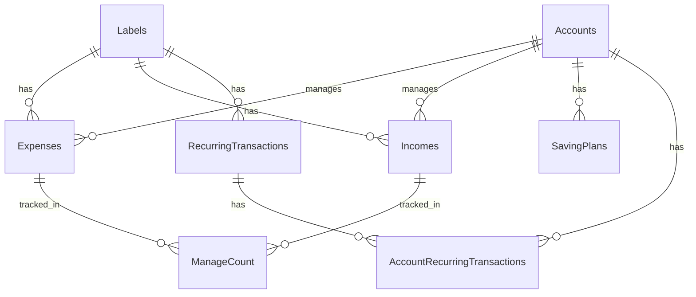

# PostgreSQL Database Documentation

This directory contains all database-related documentation for the Personal Finance Manager application.

## 📊 Entity Relationship Diagram



## 🔗 Relationships

### One-to-Many Relationships

- Labels → Expenses (A label can be associated with multiple expenses)
- Labels → Incomes (A label can be associated with multiple incomes)
- Labels → RecurringTransactions (A label can have multiple recurring transactions)
- Accounts → Expenses (An account can have multiple expenses)
- Accounts → Incomes (An account can have multiple incomes)
- Accounts → SavingPlans (An account can have multiple saving plans)

### Many-to-Many Relationships

- Accounts ↔ RecurringTransactions (Through AccountRecurringTransactions)
  - An account can have multiple recurring transactions
  - A recurring transaction can involve multiple accounts
  - The relationship includes a role (SOURCE/DESTINATION)

## 📝 Enum Types

### account_type

- `CHECKING`: Regular checking account
- `SAVINGS`: Savings account
- `CREDIT_CARD`: Credit card account
- `CASH`: Cash wallet
- `INVESTMENT`: Investment account

### account_state

- `ACTIVE`: Account is active and can be used
- `INACTIVE`: Account is temporarily inactive
- `BLOCKED`: Account is blocked from transactions
- `CLOSED`: Account is permanently closed

### label_type

- `EXPENSE`: Expense transaction
- `INCOME`: Income transaction
- `TRANSFER`: Transfer between accounts
- `INVESTMENT`: Investment transaction

### label_category

- `FOOD`: Food and groceries
- `TRANSPORT`: Transportation expenses
- `UTILITIES`: Utility bills
- `RENT`: Rent payments
- `SHOPPING`: General shopping
- `HEALTH`: Health-related expenses
- `ENTERTAINMENT`: Entertainment expenses
- `SALARY`: Salary income
- `FREELANCE`: Freelance income
- `INVESTMENT_RETURN`: Investment returns
- `GIFT`: Gifts received or given
- `OTHER`: Other transactions

### frequency_type

- `DAILY`: Daily recurring
- `WEEKLY`: Weekly recurring
- `MONTHLY`: Monthly recurring
- `YEARLY`: Yearly recurring

### transaction_type

- `INCOME`: Income transaction
- `EXPENSE`: Expense transaction

## 📑 Tables Schema Overview

| Table Name                   | Description                                   |
| ---------------------------- | --------------------------------------------- |
| Labels                       | Stores transaction categories and types       |
| Accounts                     | Manages different types of financial accounts |
| Expenses                     | Records all expense transactions              |
| Incomes                      | Records all income transactions               |
| ManageCount                  | Tracks budget management                      |
| SavingPlans                  | Manages saving goals                          |
| RecurringTransactions        | Handles recurring transactions                |
| AccountRecurringTransactions | Links accounts with recurring transactions    |

## 🔍 Indexes

The following indexes are implemented for query optimization:

```sql
CREATE INDEX idx_expenses_account ON Expenses(FKAccount);
CREATE INDEX idx_expenses_label ON Expenses(FKLabel);
CREATE INDEX idx_incomes_account ON Incomes(FKAccount);
CREATE INDEX idx_incomes_label ON Incomes(FKIncomesLabel);
CREATE INDEX idx_recurring_next_occurrence ON RecurringTransactions(next_occurrence);
CREATE INDEX idx_expenses_date ON Expenses(creation_date);
CREATE INDEX idx_incomes_date ON Incomes(creation_date);
CREATE INDEX idx_account_recurring ON AccountRecurringTransactions(FKAccount);
CREATE INDEX idx_recurring_label ON RecurringTransactions(FKLabel);
```

## 📁 Directory Structure

```
PostgresDB/
├── README.md           # This file
├── er-diagram/         # Entity Relationship diagram files
├── schema/            # Database schema SQL files
│   ├── init.sql      # Initial database setup
│   ├── migrations/   # Database migrations
│   └── seeds/        # Seed data for testing
└── docs/             # Additional documentation
    ├── queries.md    # Common SQL queries
    └── maintenance.md # Database maintenance guide
```

## 🛠 Setup Instructions

See the main README.md in the project root for complete setup instructions.
