# PostgreSQL Database Documentation

This directory contains all database-related documentation for the Personal Finance Manager application.

## 📊 Entity Relationship Diagram

```mermaid
erDiagram
    category_label_mappings ||--o{ labels : validates
    labels ||--o{ transactions : categorizes
    labels ||--o{ recurring_transactions : categorizes
    accounts ||--o{ transactions : manages
    accounts ||--o{ saving_plans : has
    accounts ||--o{ account_recurring_transactions : has
    recurring_transactions ||--o{ account_recurring_transactions : has
```



## 🔗 Relationships

### One-to-Many Relationships

- category_label_mappings → labels (A mapping can be used by multiple labels)
- labels → transactions (A label can be associated with multiple transactions)
- labels → recurring_transactions (A label can have multiple recurring transactions)
- accounts → transactions (An account can have multiple transactions)
- accounts → saving_plans (An account can have multiple saving plans)

### Many-to-Many Relationships

- accounts ↔ recurring_transactions (Through account_recurring_transactions)
  - An account can have multiple recurring transactions
  - A recurring transaction can involve multiple accounts
  - The relationship includes a role (SOURCE/DESTINATION)

## 📝 Enum Types

### account_type

- `CHECKING`: Regular checking account
- `SAVINGS`: Savings account
- `CREDIT_CARD`: Credit card account
- `CASH`: Cash wallet
- `INVESTMENT`: Investment account

### account_state

- `ACTIVE`: Account is active and can be used
- `INACTIVE`: Account is temporarily inactive
- `BLOCKED`: Account is blocked from transactions
- `CLOSED`: Account is permanently closed

### category_type

- `FOOD`: Food and groceries
- `HOME`: Home-related expenses
- `WORK`: Work-related transactions
- `ENTERTAINMENT`: Entertainment expenses
- `HEALTH`: Health-related expenses
- `HOLIDAY`: Holiday expenses
- `SHOPPING`: Shopping expenses
- `CAR`: Car-related expenses
- `TRANSPORT`: Transportation expenses
- `SPORT`: Sport-related expenses

### label_type

Examples for each category:

- FOOD: `DINNER`, `LUNCH`, `BREAKFAST`, `HAPPY_HOUR`, `MARKET_EXPENSES`
- HOME: `UTILITY_BILLS`, `GROCERY_SHOPPING`
- WORK: `SALARY`, `TAXES`, `REFUNDS`
- ENTERTAINMENT: `CINEMA`, `ART`
- HEALTH: `HEALTH_APPOINTMENTS`, `HEALTH_SHOPPING`
- etc.

### transaction_type

- `INCOME`: Income transaction
- `EXPENSE`: Expense transaction

### frequency_type

- `DAILY`: Daily recurring
- `WEEKLY`: Weekly recurring
- `MONTHLY`: Monthly recurring
- `YEARLY`: Yearly recurring

## 📑 Tables Schema Overview

| Table Name                     | Description                                         |
| ------------------------------ | --------------------------------------------------- |
| category_label_mappings        | Defines valid combinations of categories and labels |
| labels                         | Stores available transaction labels                 |
| accounts                       | Manages different types of financial accounts       |
| transactions                   | Records all financial transactions                  |
| recurring_transactions         | Handles recurring transactions                      |
| account_recurring_transactions | Links accounts with recurring transactions          |
| saving_plans                   | Manages saving goals                                |

## 🔍 Indexes

The following indexes are implemented for query optimization:

```sql
CREATE INDEX idx_transactions_account ON transactions(account_id);
CREATE INDEX idx_transactions_label ON transactions(label_id);
CREATE INDEX idx_transactions_date ON transactions(transaction_date);
CREATE INDEX idx_recurring_label ON recurring_transactions(label_id);
CREATE INDEX idx_recurring_next ON recurring_transactions(next_occurrence);
CREATE INDEX idx_labels_category ON labels(category);
CREATE INDEX idx_account_recurring ON account_recurring_transactions(recurring_id);
```

## 📁 Directory Structure

```
PostgresDB/
├── README.md           # This file
├── schema/            # Database schema SQL files
│   ├── schema.sql     # Complete database schema
│   └── data.sql       # Sample data for testing
└── docs/             # Additional documentation
    └── queries.md    # Common SQL queries
```

## Key Differences from Original Schema

1. Unified transactions table instead of separate Expenses and Incomes
2. Introduction of category_label_mappings for validation
3. Simplified label structure with ENUM types
4. Removed redundant timestamp fields
5. More structured approach to categories and labels
6. Improved transaction naming and description fields

## 🛠 Setup Instructions

1. Create a new PostgreSQL database
2. Execute schema.sql to create the database structure
3. Execute data.sql to populate with sample data
4. Configure application connection settings
